# Threadfin user guide

Threadfin turns one or more live-TV playlists into client-ready DVR, M3U, and—when using XEPG—XMLTV outputs for Plex, Jellyfin, Emby, and compatible IPTV clients.

This guide follows the order in which a new installation becomes usable: add sources, choose channels, map guide data, save the lineup, then connect a client. The screen names and button labels below match the current Threadfin web interface.

It was last verified against the Threadfin 3.2.0 UI.

## In this guide

- [Choose PMS or XEPG](#choose-the-right-guide-mode)
- [Complete first-time setup](#complete-first-time-setup)
- [Read the Overview](#read-the-overview)
- [Manage Playlist and XMLTV sources](#add-and-maintain-playlist-sources)
- [Select channels with Filter](#select-channels-with-filter)
- [Build and save the Mapping lineup](#build-the-channel-lineup-in-mapping)
- [Connect Plex, Jellyfin, Emby, or an IPTV app](#connect-plex-jellyfin-emby-or-an-iptv-app)
- [Monitor Activity and Log](#monitor-streaming-and-diagnose-problems)
- [Adjust Settings, backups, and Users](#adjust-settings-safely)
- [Troubleshoot common problems](#troubleshooting)

## Quick path

1. [Complete first-time setup](#complete-first-time-setup) with an M3U source.
2. Choose **PMS** for client-managed guide data, or choose **XEPG** and [add XMLTV](#add-xmltv-guide-data-xepg-only).
3. In XEPG mode, [select streams](#select-channels-with-filter), [map channels](#build-the-channel-lineup-in-mapping), and save the mapping.
4. [Copy an output endpoint](#connect-plex-jellyfin-emby-or-an-iptv-app) and complete setup in the target client.

If you use PMS mode, use the [PMS fast path](#pms-fast-path) after setup; the XMLTV and Mapping chapters do not apply.

## Before you begin

Have the following ready:

- A running Threadfin instance and a browser that can reach its web interface. The default HTTP port is `34400` unless the instance was started with a different `-port` value.
- An M3U playlist as an HTTP(S) URL or as a local path visible to the Threadfin process. An HDHomeRun tuner address is an alternative playlist source.
- For **XEPG** mode, an XMLTV guide as an HTTP(S) URL or a local path visible to Threadfin.
- A supported target: Plex Live TV & DVR, Jellyfin Live TV, Emby Live TV, or an IPTV client that accepts M3U and XMLTV URLs.

Keep source credentials out of screenshots, issue reports, and shared browser history. If a source is a local file, its path is resolved by the machine or container running Threadfin—not by the computer running the browser.

## Choose the right guide mode

Threadfin has two guide modes. Pick one before you build your lineup.

| Mode | Use it when | What Threadfin manages |
| --- | --- | --- |
| **PMS** | Plex, Jellyfin, or Emby will manage guide data itself. | Playlist delivery and DVR discovery. XMLTV and Mapping are not used in this mode. |
| **XEPG** | You want to bring your own XMLTV data, control channel-to-guide assignments, or use the generated M3U and XMLTV outputs. | XMLTV sources, Mapping, and generated M3U/XMLTV outputs. |

For most IPTV setups that need their own electronic programme guide, choose **XEPG**.

### PMS fast path

1. Complete the M3U step in the setup wizard with **PMS** selected.
2. Add any further M3U or HDHomeRun sources in **Sources → Playlist**.
3. Open **Lineup → Filter** and verify that the expected streams are selected. If the selected count is zero or the imported playlist exceeds Threadfin’s unfiltered channel limit, create a filter that selects the channels you want to deliver.
4. Open **Connections**, copy the **DVR address**, and finish guide/channel setup in Plex, Jellyfin, or Emby.
5. Test playback in the client. Manage guide data there rather than in Threadfin’s XMLTV or Mapping screens.

## Complete first-time setup

On a new installation, Threadfin opens the setup wizard. It collects the minimum source pipeline; you can add, edit, or remove sources later from the navigation.

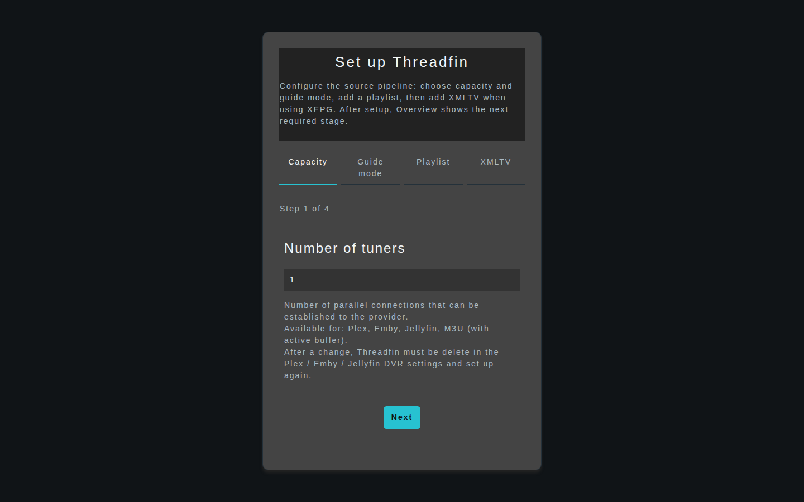

*Choose a total client/DVR capacity before connecting clients.*

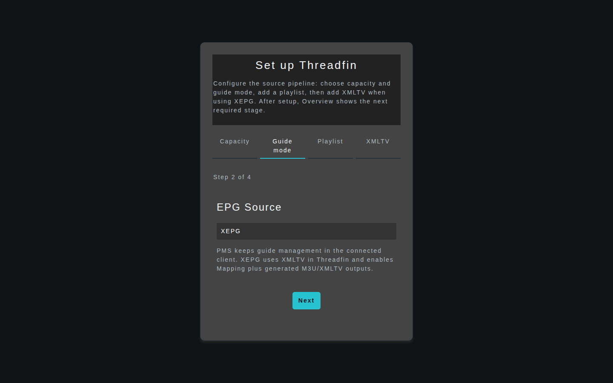

*Choose PMS for client-managed guide data or XEPG for XMLTV and Mapping in Threadfin.*

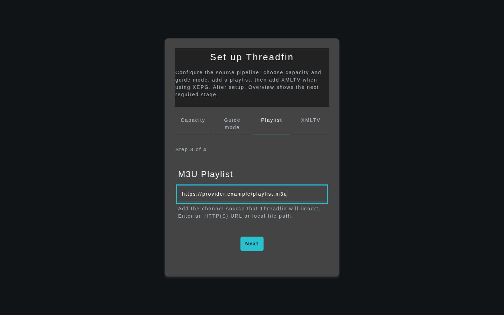

*Enter the initial M3U source URL or local path.*

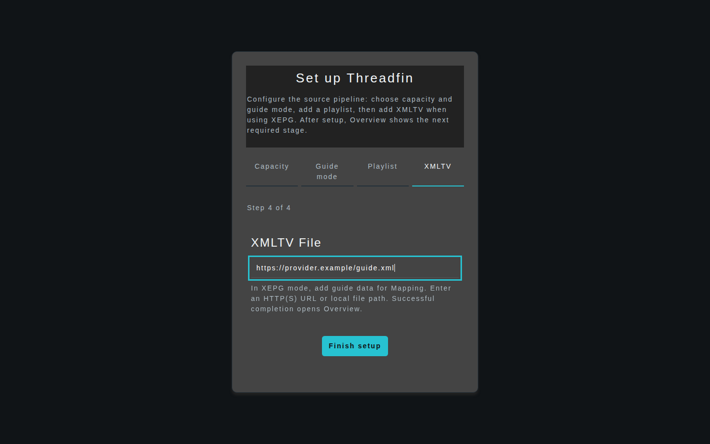

*The XMLTV step appears only for XEPG.*

1. In **Number of tuners**, select the total client/DVR capacity Threadfin should announce. Per-playlist **Tuner / Streams** settings separately limit provider connections when buffering is enabled.
2. In **EPG Source**, choose **PMS** or **XEPG** as described above.
3. In **M3U Playlist**, enter the M3U HTTP(S) URL or the local path, then select **Next**. The first-run wizard takes an M3U source; add an HDHomeRun after setup from **Sources → Playlist**.
4. If you chose **XEPG**, enter the XMLTV HTTP(S) URL or local path, then select **Finish setup**.
5. Threadfin opens **Overview**. Follow its action buttons for any stage marked *Not configured* or *Needs attention*.

The wizard accepts HTTP(S) source URLs and local paths. It does not accept another URL scheme for an M3U or XMLTV source.

> **Warning:** Changing **Number of Tuners** later changes the capacity announced to DVR clients. Remove Threadfin from the client’s DVR setup and add it again after changing this setting, otherwise the client can retain stale tuner information.

## Read the Overview

**Overview** is the operational starting point after setup. It shows the signal path from sources through the selected lineup to client-ready outputs, plus source state, output endpoints, active connection counts, and the current error/warning count.

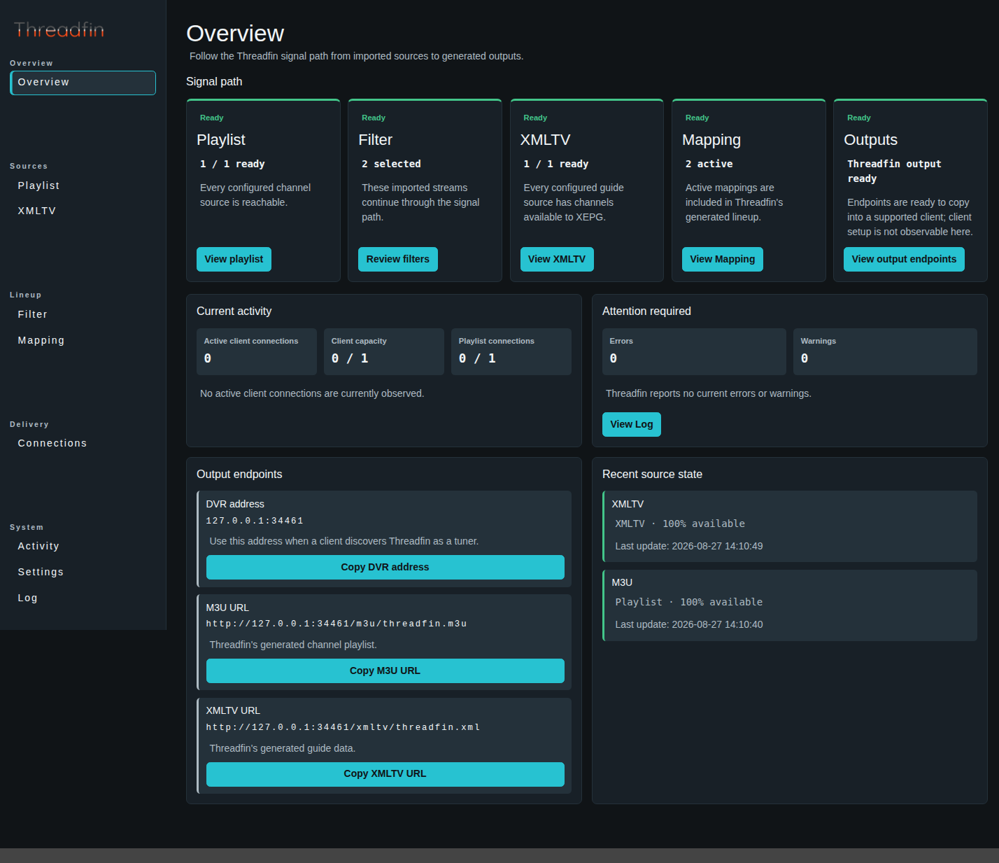

Use it to answer these questions before changing configuration:

- Are Playlist and, in XEPG mode, XMLTV sources available and recently updated?
- Does the Mapping stage need an EPG assignment or other correction?
- Are DVR, M3U, or XMLTV endpoints available to copy?
- Do the attention counts lead to a warning or error in **Log**?

The Overview’s action button takes you to the next relevant screen. It is a better first check than re-running every update after a client problem.

## Add and maintain Playlist sources

The **Playlist** screen imports streams that subsequently pass through **Filter** and, in XEPG mode, **Mapping**. It accepts M3U playlists and HDHomeRun tuners.

### Add an M3U playlist

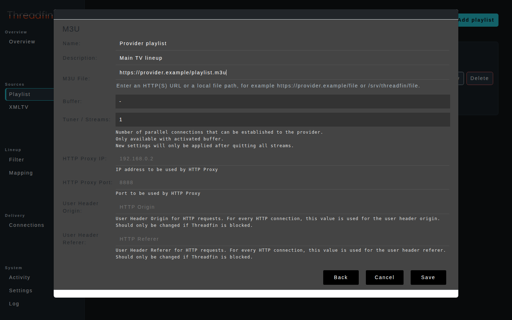

1. Open **Sources → Playlist** and select **Add playlist**.
2. Choose the M3U playlist type.
3. Enter a recognizable **Name** and, optionally, a **Description**.
4. In **M3U File**, enter an HTTP(S) URL or a local path available to Threadfin.
5. Choose the source **Buffer** (`-`, FFmpeg, or VLC) and its **Tuner / Streams** value when appropriate. These are per-source streaming settings.
6. Select **Save** and wait for Threadfin to load the source.
7. Check the source card’s availability, last update, stream count, and `group-title`, `tvg-id`, and unique-ID coverage.

High `tvg-id` and unique-ID coverage generally make later XMLTV matching and Mapping more reliable. A source card’s **Update now** action reloads that source without editing it.

### Add an HDHomeRun tuner

1. Select **Add playlist**.
2. Choose the HDHomeRun type.
3. Enter a name and the tuner’s **HDHomeRun IP**, including its port, for example `192.168.1.10:5004`.
4. Save, then verify that availability and tuner/stream information appear on the source card.

### Edit, update, or remove a source

Each source card offers **Edit**, **Update now**, and **Delete**.

> **Warning:** Deleting a Playlist removes its imported streams from the current source set. Review any filters—and, in XEPG mode, mappings—that rely on those streams before deleting it.

After a source update, visit **Filter** and, in XEPG mode, **Mapping** to review new, renamed, or no-longer-available streams.

## Select channels with Filter

**Filter** controls which imported streams Threadfin selects for delivery. In XEPG mode, those selected streams continue to **Mapping**; in PMS mode, they determine the streams available through the DVR output. The screen shows imported, selected, and excluded counts so you can confirm the scope of a rule before working on the lineup or connecting a client.

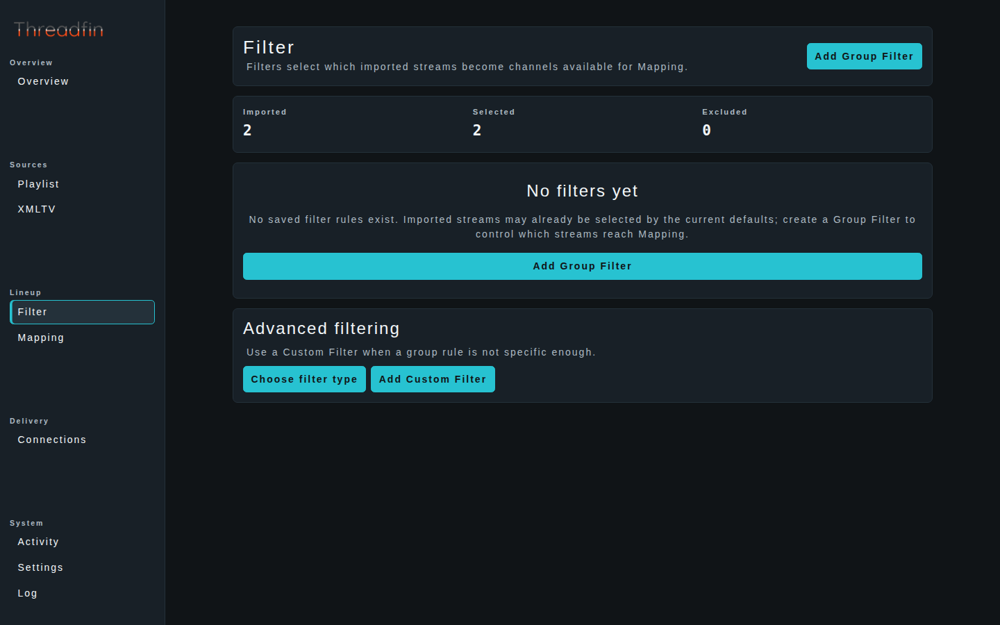

### Create a Group Filter

Use a Group Filter when the playlist contains useful M3U `group-title` values.

1. Open **Lineup → Filter** and select **Add Group Filter**.
2. Give the rule a **Filter Name**.
3. Choose the **Group Title** to include.
4. Optionally set **Filter Starting Number** and **Filter Category** for channels selected by this group.
5. Use **Include** to require one or more comma-separated words in the channel name, and **Exclude** to reject one or more comma-separated words.
6. Select **Save**, then compare the selected and excluded counts with your expectation.

For example, select a sports group, include `FHD,UHD`, and exclude `ES,IT` to keep matching high-definition channels while excluding the specified variants. Commas mean “or” within the Include or Exclude field.

### Create a Custom Filter

Use **Advanced filtering → Add Custom Filter** when a group title is not specific enough. Enter a filter rule based on the imported stream metadata.

The UI’s example syntax is:

```text
Sport {HD} !{ES,IT}
```

This narrows the match with `{…}` terms and excludes terms with `!{…}`. Use a small, testable rule first; overly broad exclusions can remove more channels than intended.

> **Warning:** Saving, editing, or deleting a filter rebuilds Threadfin’s channel database and XEPG data. Review the selected count after every significant rule change before proceeding to Mapping.

## Add XMLTV guide data (XEPG only)

In **XEPG** mode, **XMLTV** sources supply guide channels and programme data for Mapping. In **PMS** mode, the screen explains that guide management belongs to the connected client.

1. Open **Sources → XMLTV** and select **Add XMLTV**.
2. Enter a **Name** and, optionally, a **Description**.
3. In **XMLTV File**, enter an HTTP(S) URL or a local path available to Threadfin.
4. Select **Save** and wait for the guide to load.
5. Verify availability, last update, channel count, and programme count on the guide card.

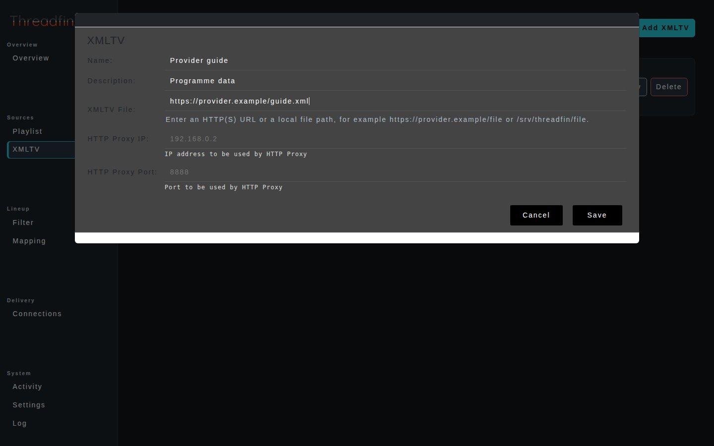

Use **Update now** to refresh one guide. If availability is zero or no successful update is recorded, resolve the source URL, local path, or network access before attempting to map channels.

## Build the channel lineup in Mapping

**Mapping** is available in **XEPG** mode. It is where you assign guide data, channel metadata, numbers, and backup streams before generating the final lineup.

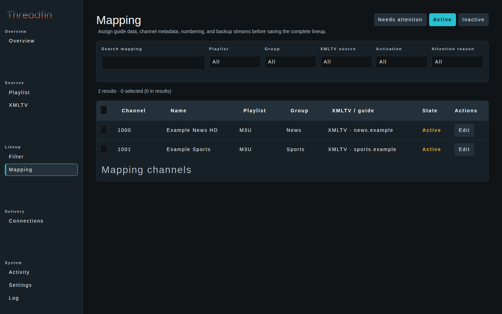

### Find channels that need work

1. Open **Lineup → Mapping**.
2. Start with **Needs attention**. A channel can need attention because it has a missing or invalid EPG assignment, is hidden from outputs, or is inactive.
3. Use **Search mapping** or filter by Playlist, Group, XMLTV source, Activation, or Attention reason to narrow the table.
4. Select **Edit** for one channel, or use the checkboxes and **Edit selected** for a bulk change. Shift-select works for a contiguous range.

### Map and activate a channel

In the editor, set the fields you need, such as:

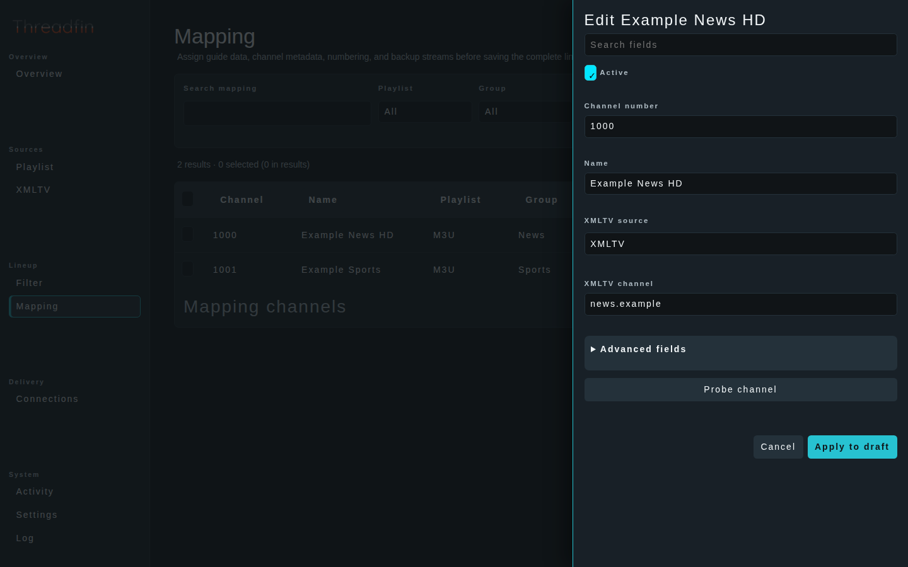

- **Active** — include the channel in generated outputs.
- **Name**, **Logo**, **Category**, and **Group** — control the delivered channel metadata.
- **XMLTV source** and **XMLTV channel** — assign the guide source and guide channel.
- **Backup channel 1–3** — choose fallback streams.
- **Hidden from outputs** — prevent that mapped channel from appearing in delivered outputs. Apply it separately to a backup stream if it should be used only as a fallback.

Apply the edit to the draft with **Apply to draft**. It is not yet delivered to clients.

You can also select several rows and choose a dummy guide duration followed by **Apply dummy guide**. This is useful when you need an active channel without matching programme data.

> **Warning:** **Save mapping** writes the complete mapping and rebuilds output files. Wait for the “Mapping saved; outputs rebuilt” or queued-rebuild feedback before configuring a client. Leaving Mapping with unsaved changes prompts you to save or discard the draft.

### Save and verify the result

1. Select **Save mapping**.
2. Return to **Overview** and confirm that the Mapping stage is ready and the expected output endpoints are available.
3. If a channel is missing, return to **Needs attention** and check its EPG assignment and Active state.

## Connect Plex, Jellyfin, Emby, or an IPTV app

Open **Delivery → Connections**. Threadfin lists the DVR address, M3U URL, and XMLTV URL cards, marking an unavailable output with the reason. Each available output has a copy button.

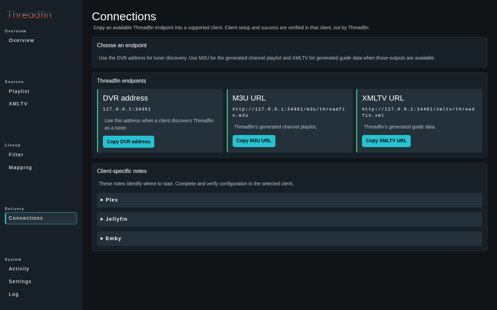

| Output | Use it for |
| --- | --- |
| **DVR address** | Tuner discovery in Plex; a possible Live TV starting point in Jellyfin or Emby depending on the client version. |
| **M3U URL** | The generated channel playlist for an IPTV application or a supported Jellyfin/Emby setup. |
| **XMLTV URL** | The generated guide data for an IPTV application or a supported Jellyfin/Emby setup. Available in XEPG mode after the lineup is saved. |

M3U and XMLTV outputs require XEPG mode, at least one active Mapping with a valid XMLTV assignment, usable output URLs, and every configured XMLTV source to be available with guide channels. The DVR address becomes available after streams are selected.

If an output is protected by authentication, a copied address can contain credential placeholders. Replace those placeholders only in the target client with the credentials of an account that has the required permission; do not publish, screenshot, or share the completed address.

### Plex

1. In **Connections**, select **Copy DVR address**.
2. In Plex, add Threadfin as a tuner in the Live TV & DVR setup and paste the address.
3. Complete guide and channel setup in Plex, then verify a channel and its programme data there.

### Jellyfin or Emby

1. In **Connections**, copy the **DVR address**, or copy the available **M3U URL** and **XMLTV URL** if the client’s setup flow supports those fields.
2. Complete the Live TV setup in the selected client.
3. Verify channel playback and guide data in that client.

### IPTV application

1. Copy the available **M3U URL** and **XMLTV URL** from **Connections**.
2. Add them to the app’s playlist and EPG/guide fields.
3. Refresh the app’s playlist and guide, then test a channel.

Threadfin can copy an endpoint, but it cannot confirm that a client accepted it. Client setup and successful playback must be verified in the client.

## Monitor streaming and diagnose problems

### Activity

**System → Activity** shows live—not historical—stream and connection state. It reports active playlist-source connections against configured playlist capacity and active client connections against configured tuner capacity.

Use it while testing a stream or when a client reports capacity errors. Near-capacity values change visual state as usage rises; reduce concurrent use or increase the appropriate capacity only after considering your provider’s limits.

### Log

**System → Log** displays the current diagnostic record and lets you search or filter DEBUG, WARNING, and ERROR entries.

When troubleshooting, reproduce one issue, then inspect the corresponding warning or error rather than resetting logs first.

> **Warning:** **Reset logs…** permanently removes the current in-memory log entries. Copy the relevant error details before resetting them.

## Adjust Settings safely

**System → Settings** groups configuration into **General**, **Files**, **Streaming**, **Backup**, and **Authentication**. Select **Save settings** only after reviewing the changed section; unrelated values are preserved by the current UI.

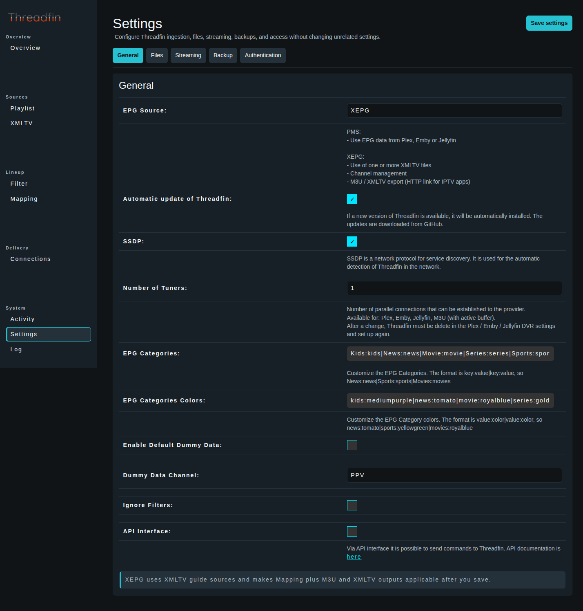

### General

- **EPG Source** switches between PMS and XEPG. XEPG makes XMLTV, Mapping, and M3U/XMLTV outputs applicable; PMS delegates guide management to the connected client.
- **Number of Tuners** is the total client capacity advertised by Threadfin.
- **SSDP** controls network service discovery.
- **Automatic update of Threadfin** installs available updates downloaded from GitHub.
- **Enable Default Dummy Data** and **Dummy Data Channel** help keep otherwise inactive live-event channels mapped to dummy data.
- **Ignore Filters** bypasses all configured filters.

> **Warning:** Switching EPG Source changes which workflow owns guide data. In PMS mode, Mapping and XMLTV management are not used; in XEPG mode, save and review your mappings before relying on generated outputs. Turning on **Ignore Filters** makes all filtering rules ineffective.

### Files

- **Schedule for updating (Playlist, XMLTV, Backup)** accepts one or more 24-hour times, such as `0800,2000`; leave it empty to disable scheduled updates.
- **Updates all files at startup** reloads Playlist, tuner, and XMLTV sources when Threadfin starts.
- **Image Caching** caches XMLTV images in the background; **Replace missing program images** uses a channel logo when a programme image is unavailable.
- **Location for the temporary files** controls writable runtime storage for buffer files.

Set local paths that the Threadfin process—not merely your interactive user—can read or write.

### Streaming

Choose the **Buffer** per Playlist source: `-` passes the stream directly to the client; FFmpeg and VLC place the selected program between provider and client and support buffering/re-streaming behavior. Set the matching FFmpeg or VLC binary path here before using that source option.

The Streaming tab also contains UDPxy, buffer size, connection timeout, User Agent, forced HTTP for FFmpeg, and program-specific options. A missing or invalid FFmpeg/VLC path prevents Threadfin from using the selected buffer when it processes a stream.

> **Warning:** Only change FFmpeg/VLC options, forced HTTP behavior, or request headers when you understand the provider and player requirements. A bad setting can prevent every client from opening a stream.

### Backup and restore

The **Backup** tab provides **Location for automatic backups**, **Number of backups to keep**, **Download backup**, and **Restore backup…**. Threadfin creates a backup before a scheduled provider-data update, so configure a path writable by the Threadfin process.

1. Select **Download backup** before a migration or a major settings change and store the downloaded archive safely.
2. To restore, select **Restore backup…**, choose the intended archive, and confirm.
3. If Threadfin reports that the web URL/port changed, restart Threadfin and use the reported URL.

> **Warning:** Restore replaces the current Threadfin data with the archive’s data. Download a current backup first and confirm that the archive belongs to the intended instance.

## Protect the web UI and outputs with Users

The setup wizard runs before web authentication. After it completes, enable **WEB Authentication** in **Settings → Authentication** and save; if no account exists, Threadfin presents the first-administrator form after the page reloads. Threadfin stores its password as an Argon2id verifier. After signing in, use **Delivery → Users** to create accounts and assign only the interfaces each account needs.

1. If this is the first account, enable **WEB Authentication** in **Settings → Authentication**, save, and complete the first-administrator form shown after reload.
2. In **Settings → Authentication**, enable the output authentication types you want to enforce (PMS, M3U, XML, or API) and save.
3. Open **Delivery → Users** and select **New user**.
4. Enter and confirm the password.
5. Grant the smallest necessary permissions, then save:
   - **WEB**: sign in to the Threadfin web interface.
   - **PMS**: authenticate DVR discovery/access for Plex, Emby, or Jellyfin.
   - **M3U**: authenticate requests for the generated M3U playlist.
   - **XML**: authenticate requests for the generated XMLTV guide.
   - **API**: authenticate Threadfin API commands.
   - **CONFIG**: authorize the typed configuration workflow, including source fetches from permitted private-LAN destinations.

The default user always retains WEB access and cannot be deleted. Passwords are available only while an account is created or edited.

> **Warning:** Disabling **WEB Authentication** causes Threadfin to clear PMS, M3U, XML, and API authentication on the server. Enabling authentication for an output changes the URL/address your client must use; update the client configuration and test it immediately.

## Troubleshooting

### A source will not load or is unavailable

1. In **Playlist** or **XMLTV**, check the source card’s availability and last-update value.
2. Confirm that an HTTP(S) URL is reachable from Threadfin, or that a local path exists inside the Threadfin host/container and has suitable permissions.
3. Select **Update now** for that one source.
4. Open **Log** and inspect the error or warning produced by the failed update.

### No channels appear in Mapping

1. Verify that a Playlist source has streams.
2. Open **Filter** and check the Imported, Selected, and Excluded counts.
3. Create or correct a Group Filter, or review a Custom Filter for overly broad terms.
4. Return to Mapping and use **Needs attention** to find streams without usable guide assignments.

### Generated M3U or XMLTV endpoint is unavailable

1. Confirm that **EPG Source** is **XEPG**.
2. Verify that every configured XMLTV source is available and has guide channels.
3. In Mapping, assign guide data, activate the required channels, and select **Save mapping**.
4. Return to Overview or Connections and copy the newly available endpoint. If it is protected, replace its placeholders with the permitted account credentials only in the client.

### A client cannot find Threadfin or has the wrong tuner count

1. Open **Filter** and verify that the expected streams are selected. If the selected count is zero, correct or create a filter first.
2. Copy the current **DVR address** from **Connections** rather than reusing an old address.
3. Verify that the client can reach the Threadfin host and configured port.
4. After changing **Number of Tuners**, remove Threadfin from the client’s DVR configuration and add it again.
5. If output authentication is enabled, update the client with the authenticated address/URL generated by Threadfin.

### Playback fails or too many connections are open

1. Open **Activity** while reproducing the failure.
2. Compare active playlist-source and client connections with their configured capacities.
3. Check the affected Playlist source and **Log** for source-side or buffer errors.
4. If using FFmpeg or VLC buffering, verify the binary path and then review only the streaming option relevant to the failure.

## Keep the configuration healthy

- Use **Overview** after any source, filter, mapping, or client change.
- Refresh only the source that changed, then check Filters and Mapping before saving a new lineup.
- Download a backup before major changes and before updating the application.
- Treat the addresses in **Connections** as authoritative: copy them again after changing authentication, EPG mode, host/domain settings, or port.
- Test one channel and its guide in the target client after every meaningful lineup change.

For installation choices and runtime examples, see the [project README](../README.md). For current project updates and support channels, use the links in that README.
